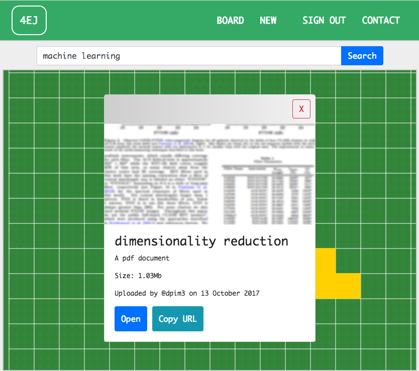

# Forage - visual document exploration

## About
4EJ (pronounced "forage") is a web app for visually organizing longform information like PDFs and infographics. 

### Functionality
- Users can register accounts and upload documents to a global grid
- Documents are clustered by keywords within the grid
- Users can search by moving their cursor in the grid or by using the search box

## Installation
- Set up [GCP Storage]("https://cloud.google.com")
- Update server-side credentials under `4ej-service/config/secrets`
- Install service and web app dependencies with `npm install`
- Run service and web app with `npm start`
